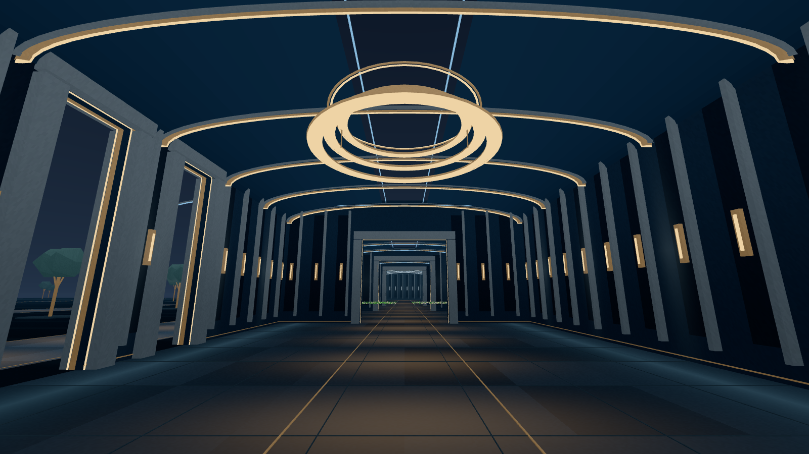

# the orchard

Walk inside a particle simulation. Pause it, move through it, and see where
the picture came from.

The orchard turns research outputs into rooms you can visit in a browser.
Its public world, **the Mind Palace**, brings particle tapes, videos and figures
into **the Observatory**, a nocturnal museum and its gardens. Its local tools collect those outputs, keep
their provenance, and let the host choose what hangs.

[Visit the Mind Palace](https://weichseltree.com/mind/) ·
[Run the local demo](#run-the-local-demo) ·
[Bring your research](#bring-your-research) ·
[Contribute](CONTRIBUTING.md)



*The Observatory in the browser, captured in the local demo with controls
hidden. Distant particles are synthetic playback fixtures.*

Begin with a question: **Patterns** compares a mixture with its control,
**Worlds** follows heavy and light matter, and **Bonds** watches one atomic
capture. Each chamber's guide explains what to look for and what the evidence
can establish. [The Observatory design](docs/specs/OBSERVATORY.md) describes
the rebuilt architecture, exhibit stories and reproducible camera checks.

## What you can do

- **Explore a result.** Walk through recorded particles, pause time, move
  frame by frame, and inspect the tape's source. Desktop, touch and WebXR
  controls share the same world.
- **Show your research.** Bundle particle tapes, videos and stills with
  content hashes and provenance. Hang approved outputs without rebuilding
  the client when the room follows a live exhibit.
- **Run an orchard.** Track research trees, measured compute spend, review
  requests and rulings from a local dashboard. A tree is a research
  repository; its harvest is what visitors can see.

This is an early working platform. Particle playback, rooms, media bundles,
presence and the local dashboard are implemented. **Quest and iPhone hardware
validation remains open.** Spatial voice, browser host access, linked nodes
and the shared episode production studio are planned. The studio's current
scope is described in [studio/README.md](studio/README.md); the broader
direction is in [PLATFORM.md](docs/PLATFORM.md).

## Run the local demo

You need **Node.js 22** and **pnpm 10.29.2**. Run from a fresh checkout:

```bash
git clone https://github.com/weichseltree/orchard.git
cd orchard/grove
pnpm install --frozen-lockfile
pnpm demo
```

Open [localhost:5173/mind/?demo](http://localhost:5173/mind/?demo). You land
beside moving particles in the Mixing Chamber. Click the view, use **WASD**
or the arrow keys to walk, move the mouse to look, and press **Space** to
pause. **Esc** releases the pointer so you can use the on-screen controls.

The demo generates its own synthetic particles and runs without API keys,
a database, production media or a headset. It is a playback demonstration,
not scientific evidence. If FFmpeg is installed, it also generates a test
video. Stop the server with **Ctrl+C**.

For touch controls, development settings, build checks and troubleshooting,
see [grove/README.md](grove/README.md).

For repeatable checks, run `pnpm quality` from `grove/`. It tests playback,
checks types, builds the site and enforces size budgets.
[Quality measurements](docs/QUALITY.md) adds automated browser checks and
explains the local performance reports.

## Use the local tools

The Python tools require **Python 3.12 or later** and **uv**. From the
repository root:

```bash
uv sync --locked
uv run orchard --help
uv run orchard board
uv run orchard serve
```

Open [127.0.0.1:8787](http://127.0.0.1:8787) for the local dashboard.
The checked-in tree manifests let you inspect the portfolio without cloning
every research repository. The ledger reads local job records and expdash;
on a new machine, no recorded spend and an unavailable expdash are expected.
The greenhouse panels need a configured SpacetimeDB connection.

`uv run orchard doctor` reports installed tools and optional service
configuration. Missing cloud or narration credentials do not prevent the
local demo, portfolio inspection or bundle verification. Configure only the
services you intend to use; [secrets.example.env](secrets.example.env)
explains each group. Hosting setup is in [HOSTING.md](docs/HOSTING.md).

## Bring your research

The smallest integration is an existing result: a particle tape in
[`video/tape/1`](packages/tape/README.md) format, an MP4, or a still image.
The bundler writes local output without publishing it:

```bash
uv run orchard bundle tape /path/to/tape --tree my-research --title "A particle tape"
uv run orchard bundle video /path/to/clip.mp4 --tree my-research --title "A result in motion"
uv run orchard bundle still /path/to/figure.png --tree my-research --title "A measured result"
uv run orchard bundle verify results/bundles/BUNDLE_ID
```

Replace the paths with your own files and `BUNDLE_ID` with the directory
name printed by the bundler. Video and still conversion require FFmpeg;
`orchard doctor` checks the media tools. Verification checks the bundle's
identity and recorded digests without a token.

For a continuing research tree, `uv run orchard scout /path/to/my-research`
drafts `trees/my-research.yaml`. Review its question, paths and artefacts,
then `uv run orchard plant my-research` writes `orchard.yaml` into that
research repository. That file becomes canonical; `trees/` keeps a mirror.

```bash
uv run orchard harvest my-research --dry-run
uv run orchard harvest my-research
```

Harvest bundles supported artefacts and records their hashes and bundle
identities. It refuses unfinished tapes and dirty research repositories by
default. It does not run simulations or publish results.

Once hosting is configured, `orchard exhibit hang results/bundles/BUNDLE_ID`
uploads and hangs an approved artefact. Adding `--approve` records the
host's ruling in its manifest. See the
[harvest and exhibit guide](docs/impl/M2-harvest-exhibit.md) for the full
flow, including dry runs and taking an exhibit down.

## How it fits together

| Path | Purpose |
| --- | --- |
| [grove/](grove/README.md) | Browser world and public site; Three.js, TypeScript and Vite |
| [orchard/](orchard/) | Python CLI, manifests, bundling, ledger and local dashboard |
| [packages/tape/](packages/tape/README.md) | Shared particle tape format and Python reader/writer |
| [spacetime/](spacetime/) | World state, presence, exhibits, reviews and moderation |
| [trees/](trees/) | Draft manifests and mirrored research manifests |
| [studio/](studio/README.md) | Planned shared episode production tools |
| [docs/](docs/) | Design, implementation notes, hosting and validation evidence |
| [brand/](brand/README.md) | Visual identity and [writing voice](brand/VOICE.md) |

The fund buys an episode thesis: one viewer question, one measured number
and one picture. The intended stages run from a first idea through a
styleframe, animatic and render ruling to an episode and its room. Expensive
renders need a measured cost and a ruling first. [LAWS.md](docs/LAWS.md)
records the editorial rules; [BACKLOG.md](docs/BACKLOG.md) records work and
validation still owed.

The first orchard is [weichseltree](https://github.com/weichseltree)'s.
Contributions to playback, device testing, documentation and research
integration are welcome; [CONTRIBUTING.md](CONTRIBUTING.md) gives starting
points and the checks for each area.

## License

[AGPL-3.0-or-later](LICENSE). You can run your own node and modify the
platform under the terms of that license.
