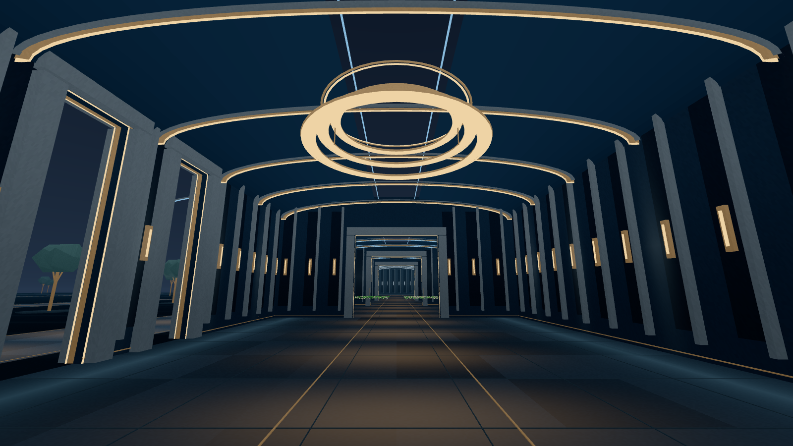

# Palace replacement: the Observatory

The former Austrian palace is replaced by a nocturnal research museum:
layered stone portals, illuminated vaults, a suspended hall fixture, distinct
chamber finishes and open garden colonnades. All 13 areas use new runtime
geometry. The wider axial portals make the research visible down the building.
Room URLs, presence IDs, tape definitions and their source data are preserved.

This is an actual Chromium/SwiftShader capture of the local demo at native
1600 × 900 resolution with HTML controls hidden. Distant particles are
synthetic fixtures. The site uses a lossless WebP with identical decoded RGBA
pixels; [imagery.json](../../grove/public/site/imagery.json) records the camera,
source image, code hashes and encoding.

The website now introduces Patterns, Worlds and Bonds through concrete
questions. The companion guide gives observations, species meaning, source
links and limits for each research chamber. Demo text explicitly replaces
scientific observations with instructions for inspecting synthetic fixtures.
Movement controls remain accessible in a disclosure, with an early action
to return to the world. The Reconstruction Gallery is described as still
studies; empty walks are places to pause, not claims of unreleased exhibits.

## Build and geometry

| Measurement | Previous checkout | Observatory |
| --- | ---: | ---: |
| Complete site build | 113,682,707 B | 3,423,695 B |
| Files in build | 77 | 27 |
| Startup JavaScript, gzip | 199,417 B | 202,044 B |
| All JavaScript, gzip | 486,310 B | 492,665 B |
| CSS, gzip | 2,505 B | 3,540 B |
| Site images | 641,095 B | 604,359 B |
| Current-scene baked asset references | 52 files available locally | 0 |

The complete build is 97.0% smaller than this operator checkout's previous
build. That comparison includes its optional legacy PNG lightmaps: the
previous clean CI build was 49,499,454 B, so the reduction against that
baseline is 93.1%. Research media remains a separate streamed payload.
The new total-build budget is 4 MB. The richer content adds 1.3% startup
JavaScript and 1,035 gzip bytes of CSS; these are recorded costs.

The architecture uses **141 draw batches and 74,420 triangles across all 13
areas**, with 14 geometries and 32 material variants. Per-view renderer
counts also include scientific media, pedestals and the sky. The surface
shader's stone variation and light pools are authored architectural shading;
they do not represent a physical lighting simulation. Tape, video and still
materials retain their independent rendering rules.

## Validation

- 285 frontend tests and four browser-helper tests passed; TypeScript,
  production build, fingerprinting and all byte budgets passed. The last
  copy clarification was also checked with the five content tests and a
  fresh build.
- 238 Python tests passed. The existing dependency deprecation warning and
  two tape timing notes remain visible.
- 97 demo browser checks, 47 production browser checks and 21 world checks
  passed. The world check inspects every area, waits for source frames,
  checks the architecture budget and rejects retired asset/decoder requests.
- Automatic WCAG A/AA checks reported zero violations. Three landing
  contrast groups require manual interpretation of gradients/non-text marks;
  the saved manual check found a minimum 7.20:1 text contrast. Actual guide
  checks at desktop, 390 px and 320 px reported no axe findings.
- Mesh rays cover open and closed doorways, along with spawn clearance.
  Navigation tests exercise the shoulder boundary of the wider apertures.
  Media-panel tests use the current hangings instead of retired bake metadata.
- Independent review verified that the archived scene exactly matches the
  prior scene and that every tape definition is preserved. The Observatory
  startup closure excludes the legacy GLTF/KTX2/Basis loader path.

[The adjacent JSON](2026-09-14-observatory.json) records report hashes, build
comparisons and browser transfer/readiness samples. The first production
measurement overlapped the demo browser run; it is retained separately from
the subsequent serial run on the final build. Cold/warm headless timings
remain machine-load sensitive and do not establish physical-device speed.

The final serial run observed cold geometry readiness at 284 ms on desktop
and 284 ms on the emulated phone, versus 969 ms and 838 ms previously.
Early cold local transfer fell from 11.73 MB / 9.91 MB to 0.214 MB; all 12
rooms in the hall neighbourhood were ready in the observation window. Warm
desktop readiness regressed from 5.14 s to 6.19 s; warm phone readiness
improved from 3.72 s to 2.62 s. The desktop warm-start delay needs further
profiling; neither a smaller download nor these software-renderer timings
guarantee a better hardware frame rate.

## What remains

Check the new surfaces, text and frame cadence on physical Quest and iPhone
hardware. Verify the complete live exhibit experience with the production
services; offline production checks deliberately block those services.
Continue research work on the shared cut-plane and the channels absent from
browser bundles before making claims that depend on seeing a ball's centre
or its temperature. Those scientific limitations remain explicit in the guide.

[OBSERVATORY.md](../specs/OBSERVATORY.md) is the current design contract.
The prior palace scene, bake tools, design records and station baselines are
preserved as historical evidence. This change builds and tests locally; it
does not publish new research bundles or deploy the hosted site.
